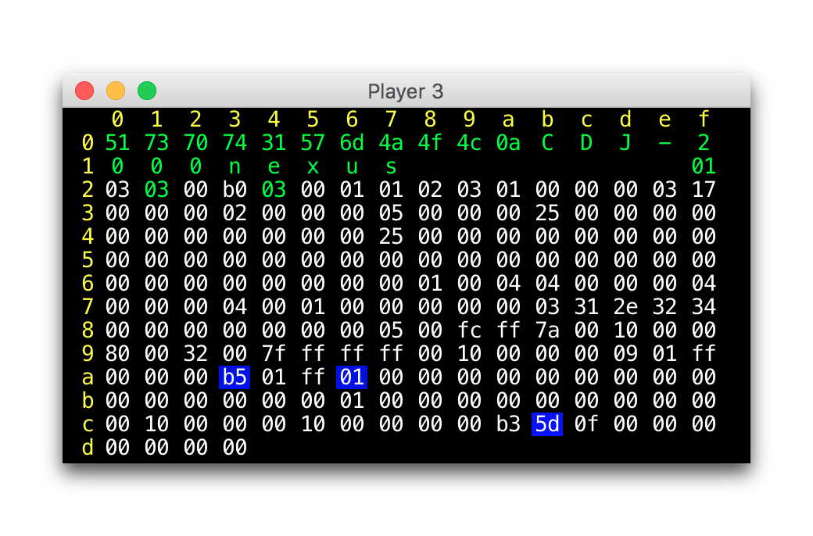

# dysentery
Exploring ways to participate in a Pioneer Pro DJ Link network.

[](#license)

## Quick Start

To watch and analyze the packets being sent between your Pioneer gear,
download and run the latest `dysentery.jar` file from the
[releases](https://github.com/brunchboy/dysentery/releases) page. You
will need a
[Java runtime envirnonment](https://java.com/inc/BrowserRedirect1.jsp)
Once you have a recent one installed, you can probably run dysentery
by just double-clicking the jar file. See the [Status](#status)
section for more details, explanation, and a screen shot.

> :wrench: If you&rsquo;re looking for a library to use in your own
> projects, that&rsquo;s what
> [beat-link](https://github.com/brunchboy/beat-link#beat-link) was developed
> for.
>
> :star2: And if you want to synchronize shows without having to
> write your own software, check out
> [beat-link-trigger](https://github.com/brunchboy/beat-link-trigger#beat-link-trigger).

## Disclaimer

This is in no way a sanctioned implementation of the protocols. It
should be obvious, but:

> :warning: Use at your own risk! For example, there are reports that
> the XDJ-RX crashes when dysentery starts, so don't use it with one
> on your network unless we can figure that out.

While these techniques appear to work for us so far, there are many
gaps in our knowledge, and things could change at any time with new
releases of hardware or even firmware updates from Pioneer.

That said, if you find anything wrong, or discover anything new,
*please*
[open an Issue](https://github.com/brunchboy/dysentery/issues) or
submit a pull request so we can all improve our understanding
together.

## Analysis

A major goal of this project is the
[Packet Analysis](doc/Analysis.pdf), which is intended to be useful to
anyone who wants to write code to interact with DJ Link networks.
Check out what we have learned so far, and please help us figure out
more if you can!

The packet captures used to create that document can be downloaded
([Sections 1 and 2](doc/assets/powerup.pcapng),
[Sections 3 and 4](doc/assets/to-virtual.pcapng)) so you can see if
you notice anything we have not, even if you don&rsquo;t have any
Pioneer gear to try out.

## Status

Dysentery is currently being developed as a
[Clojure](http://clojure.org/) library, because I find that to be the
most powerful development environment available to me at the moment.
[beat-link](https://github.com/brunchboy/beat-link#beat-link), which
is intended to be useful in other projects, is a standard Java package
on Maven Central. If you want to hack on the dysentery source, you'll
need to learn a little bit about Clojure. Finally,
[beat-link-trigger](https://github.com/brunchboy/beat-link-trigger#beat-link-trigger)
builds a friendly graphical interface on top of beat-link, making it
easy to synchronize light shows, videos, and Ableton Live to tracks
played on CDJs.

You can run dysentery and look at what it finds on your network by
just downloading and executing the jar, though, and we hope you will,
to help us gather more information!

It is already able to watch for DJ Link traffic on all your network
interfaces, and tell you what devices have been noticed, and the local
and broadcast addresses you will want to use when creating a virtual
CDJ device to participate in that network.

Here is an example of trying that out by running Dysentery as an
executable jar on my network at home:

```
> java -jar dysentery.jar
Looking for DJ Link devices...
Found:
   CDJ-2000nexus /172.16.42.4
   DJM-2000nexus /172.16.42.5
   CDJ-2000nexus /172.16.42.6

To communicate create a virtual CDJ with address /172.16.42.2,
MAC address 3c:15:c2:e7:08:6c, and use broadcast address /172.16.42.255

Close any player window to exit.
```

It also creates a virtual CDJ to ask those devices to send status
updates, and opens windows tracking the packets it receives from them.
When a packet changes the value of one of the bytes displayed, the
background of that byte is drawn in blue, which gradually fades back
to black when the value is not changing. This helps to identify what
parts of the packet change when you do something on the device being
analyzed.

To further focus analysis, if a byte has a value that we expect, it is
colored green; if it has an unexpected value, it is colored red. Bytes
that we don&rsquo;t yet understand are colored white. If you see any
white values changing, that is a puzzle that remains to be
solved&mdash;see if you can identify any pattern, or figure out what
they might convey. If you do, or if any byte value shows up in red,
please [open an Issue](https://github.com/brunchboy/dysentery/issues)
to let us know. Bytes which are expected to contain the device name
are rendered as text rather than hex, to make them more readable.



Underneath the raw byte values there is a timestamp which shows when
the most recent packet was received. As with the byte values, its
background will flash blue when the timestamp changes, and fade to
black over the next second, until the next packet is received.

Beneath the timestamp is a an interpretation of the meaning of the
packet, as best we can currently understand it, with italic field
labels corresponding to the byte fields identified in Figures
9&ndash;12 of the [Packet Analysis document](doc/Analysis.pdf).

> If you have access to any Pioneer Nexus gear, please run Dysentery
> and see if the results it gives seem to make sense for your
> equipment. So far it has only been tested with a pair of CDJ-2000
> nexus players and a DJM-2000 nexus mixer. Even better, if you can
> help us figure out more of the meanings of the packets, or identify
> things that we don&rsquo;t yet have right, and thereby improve the
> analysis for everyone, please
> [open an Issue](https://github.com/brunchboy/dysentery/issues)!

To try this, download the latest `dysentery.jar` from the
[releases](https://github.com/brunchboy/dysentery/releases) page, make
sure you have a recent Java environment installed, and run it as shown
above.

To build it yourself, and play with it interactively, you will need to
clone this repository and install [Leiningen](http://leiningen.org).
Then, within the directory into which you cloned the repo, you can
type `lein repl` to enter a Clojure Read-Eval-Print-Loop with the
project loaded:

```
> lein repl
nREPL server started on port 53806 on host 127.0.0.1 - nrepl://127.0.0.1:53806
REPL-y 0.3.7, nREPL 0.2.12
Clojure 1.8.0
Java HotSpot(TM) 64-Bit Server VM 1.8.0_77-b03
dysentery loaded.
dysentery.core=> 
```

At that point, you can evalute Clojure expressions:

```clojure
(view/find-devices)
;; => Looking for DJ Link devices...
;; => Found:
;; =>   CDJ-2000nexus /172.16.42.5
;; =>   DJM-2000nexus /172.16.42.3
;; =>   CDJ-2000nexus /172.16.42.4
;; =>
;; => To communicate create a virtual CDJ with address /172.16.42.2,
;; => MAC address 3c:15:c2:e7:08:6b, and use broadcast address /172.16.42.255
nil
```

To build the executable jar:

```
> lein uberjar
Compiling dysentery.core
Compiling dysentery.finder
Compiling dysentery.util
Compiling dysentery.vcdj
Compiling dysentery.view
Created /Users/james/git/dysentery/target/dysentery-0.1.0-SNAPSHOT.jar
Created /Users/james/git/dysentery/target/dysentery.jar
```

### History

This research began in the summer of 2015 as I was trying to figure
out a reliable way to synchronize
[Afterglow](https://github.com/brunchboy/afterglow#afterglow) light
shows with performances on my CDJs. I broke out
[Wireshark](https://www.wireshark.org) and after staring at packet
captures over a weekend, I was able to identify how to track the
current BPM and beat locations by passively watching broadcast
traffic, which was my main goal. I still could not get a lock on where
the down beat fell, because I could not tell which player was the
Master.

In the spring of 2016 I saw a posting on the original
[VJ Forums thread](http://vjforums.info/threads/cdj-2000-ethernet-protocol-for-live-bpm-sync.39265/page-2#post-295258)
where we had been discussing this, announcing that
[Diogo Santos](mailto:diogommsantos@gmail.com) had made an important
breakthrough. By broadcasting packets that pretended to be a CDJ, his
software was able to get the other players to start sending it more
details, including information I had not been able to find in other
ways. He was kind enough to share his code, and that was the impetus
behind starting this project, to consolidate what people are learning
about this protocol, and make it available for other projects to
benefit from.

### Why Dysentery?

The name of this project is a reference to one of the infamous hazards faced in
[The Oregon Trail](https://en.wikipedia.org/wiki/The_Oregon_Trail_%28video_game%29),
a game which helped many students in the eighties and nineties understand what life
was like for pioneers exploring the American West. Since we are exploring the
protocol used by Pioneer gear, it seemed at least slightly appropriate. And, ok, I
have a hard time resisting forced puns. Let's hope none of us see:

[](http://www.strangeloopgames.com/you-have-died-of-dysentery-how-games-will-revolutionize-education/)

## License


Copyright © 2016 [Deep Symmetry, LLC](http://deepsymmetry.org)

Distributed under the
[Eclipse Public License 1.0](http://opensource.org/licenses/eclipse-1.0.php),
the same as Clojure. By using this software in any fashion, you are
agreeing to be bound by the terms of this license. You must not remove
this notice, or any other, from this software. A copy of the license
can be found in
[LICENSE](https://rawgit.com/brunchboy/dysentery/master/LICENSE)
within this project.
